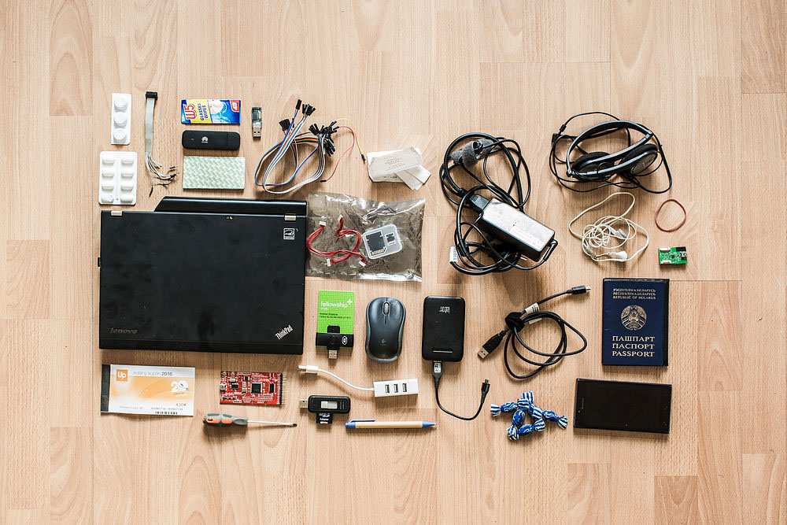
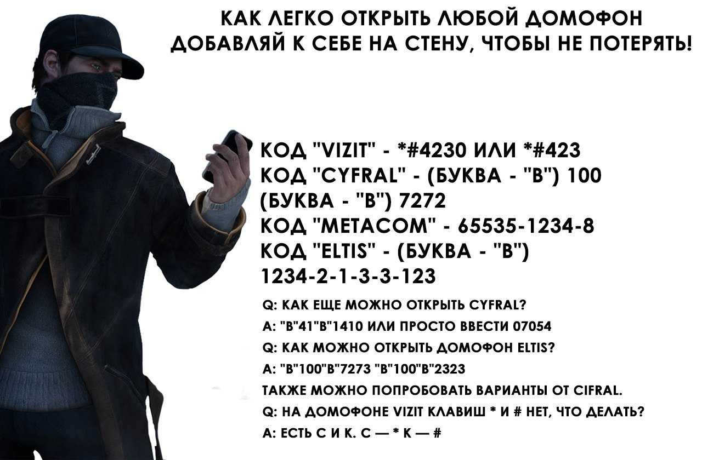
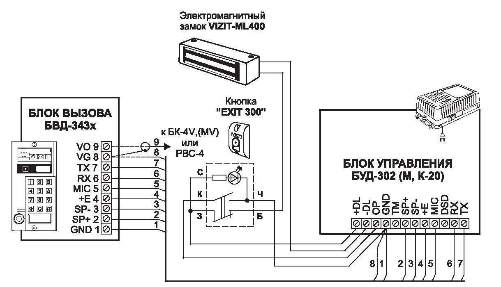
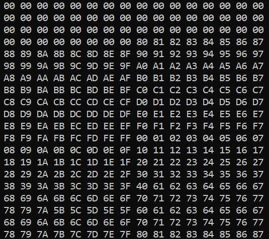
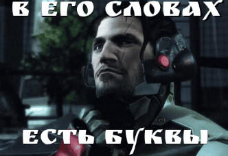

<style type="text/css">
  .reveal pre code {
    font-size: 1em;
    line-height: 1.2;
    height: 200%;
    max-height: 1000% !important;
  }
  .reveal section p {
    display: inline-block;
    font-size: 0.9em;
    line-height: 1em;
    vertical-align: top;
  }

  .reveal section li {
    font-size: 0.9em;
    line-height: 1em;
    vertical-align: top;
  }

  .reveal section table {
    display: inline-block;
    font-size: 0.7em;
    line-height: 1.2em;
    vertical-align: top;
  }

</style>


# ISCRA Junior 
ШМБ -- школа молодого безопасника

--

### Зачем вы сюда пришли?
На ответ дается 30 секунд

--

### Определились ли вы, кем хотите стать в жизни?

--

### Вам точно нужно к нам!

--

### Мы кто

- Руководитель клуба -- Полина
- Заместитель руководителя -- отдыхает на море
- Заместитель заместителя -- Дима
- Активист-приколист -- Ева

--

#### Чем мы занимаемся
- Наставничество
- Организация курсов
- Организация конференций
- Менторство проектов (как курсовых, так и не очень)
- Поддержка собственного курса по программированию
- Ходим в бар

--


---

### Фундаментальные основы хакерства
by ISCRA x CBear

--

## Внимание -- выключаем голову 

--

### Кто из вас хотел бы стать хакером?

--

> Hack -- рубить, кромсать (но не уродовать)

--

Хакер -- это энтузиаст, специалист в компьютерной области

--

>"Стать хакером очень просто. 
Достаточно выучить и понять: 
математический анализ, теорию функций 
комплексного переменного, алгебру, 
геометрию, теорию вероятностей, 
математическую статистику, 
математическую логику и дискретную 
математику...".

>Борис Леонтьев "Хакеры & Internet"

--

#### Исследование программ плотно связано с информационной безопасностью

--

>"The only secure computer is 
one that's unplugged, locked in a safe, 
and buried 20 feets under the ground in 
a secret location... and I'm not even too 
sure about that one…" 

>Dennis Huges, ФБР США

--

#### Чему вы сейчас научитесь?

--

Ничему :)

---

#### Представим типичную ситуацию в жизни хакера

--


--


---

#### Представим типичную ситуацию в жизни хакера

--


--


--


--



--

## Ваши идеи?

--

### Включаем голову, но чуть-чуть

---

# Шаг 1
Логический

--



---

# Шаг 2
Технический

--



---

# Шаг 3
Социально-инженерный / сетевой

--

```c
//Система аутентификации с проверкой паролем

//Подключаемые библиотеки
#include <stdio.h>
#include <string.h>

// Константы для нашей программы
#define PASS_SIZE 100
#define PASSWORD "..."

int compare(char* str_1, char* str_2) {
    for (int i = 0; i < PASS_SIZE; ++i) {
        if (str_1[i] != str_2[i]) {
            return i + 1;
        }
    }
    return 0;
}
```

--

```c
int main() {
    int count = 0; // счетчик попыток
    char password[] = PASSWORD; //
    char buff[PASS_SIZE];  // Буфер для пароля, вводимого системой 
    
    // Цикл аутентификации
    for (;; ++count) {
        printf("Enter password: ");

        // Считываем пароль с клавиатуры
        fgets(&buff[0], PASS_SIZE, stdin);

        // Сверяем введеный и оригинальный пароль
        if (compare(buff, password)) {
            printf("Wrong password\n"); // Сообщаем об ошибке
        } else {
            break; // Выход из цикла
        }

        // Выходим при трех неудачных попытках
        if (count == 2) {
            return -1;
        }
    }

    printf("Password OK. Welcome to the club, buddy!");
    return 0;
}
```

--

### Здесь сокрыта возможность для хака

--

>Если защита базируется на одном лишь предположении, что ее код не будет изучен и/или изменен – это плохая защита. В идеальном случае знание алгоритма работы защиты не должно влиять на ее стойкость, но это достижимо далеко не всегда.

---

# Шаг 4
Бинарный

--

### СРОЧНО ВЫКЛЮЧАЕМ ГОЛОВУ!

--



--

#### Тут мы сталкиваемся с assembler
Это ближайший к машинным инструкциям язык программирования

--

### Чем он лучше бинарного кода?

--



---

### Шаг 5
Хирургический

--


---

### Вопросы?

--

### Приходите к нам на курс программирования CBeer

Можете писать мне -- @demon1747
